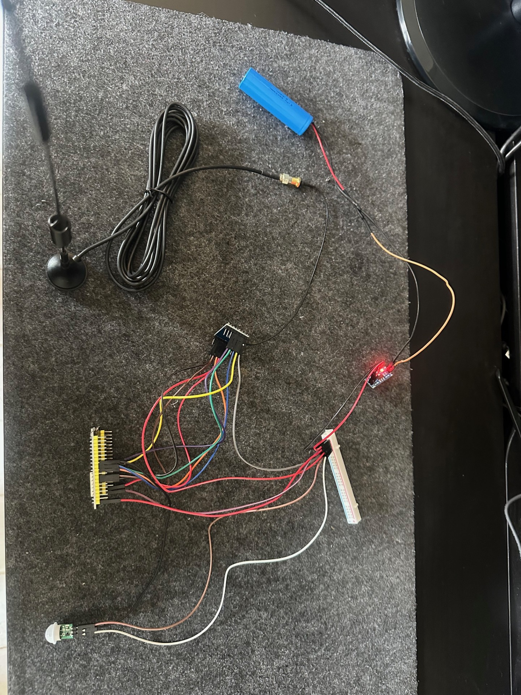
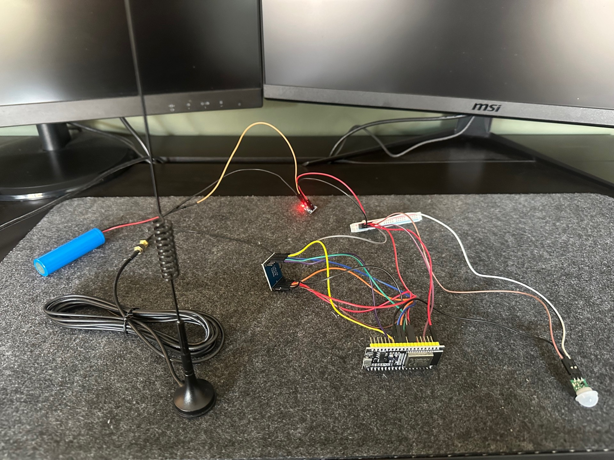

# MAILBOX-NODE

## 📖 Overview  
This node is part of the **Hager Smart Home** system and is responsible for detecting motion in the mailbox. It sends a message via **LoRa** to the **bridge-node**, which then relays the information to the web server backend. This setup allows me to monitor mailbox activity remotely, even though Wi-Fi doesn’t reach the mailbox itself.

The mailbox node uses a **PIR motion sensor** to detect activity and an **SX1278 LoRa module** to send a "Hello" message to the bridge node whenever motion is detected.

---

## ⚙️ Functionality  
This node is responsible for motion detection in the mailbox and sending the detection data to the **bridge-node** via **LoRa**. Here's a breakdown of its core functionality:

### 1. Motion Detection (PIR Sensor)  
- The device uses a **PIR motion sensor** to detect movement.  
- When motion is detected, the device sends a LoRa message ("Hello") to the **bridge-node** via the **SX1278 LoRa module**.

### 2. LoRa Transmission (SX1278)  
- The **SX1278 LoRa module** is initialized for transmission with the following settings:
  - **Frequency**: 437 MHz
  - **Spreading Factor**: **SF9**
  - **Bandwidth**: **125 kHz**
  - **Sync Word**: **0x12**
  - **Preamble Length**: **8 symbols**
  - **Transmission Power**: Configured dynamically
  
- When motion is detected, the device triggers the **tx_callback** function, which sends a "Hello" message to the **bridge-node** over LoRa.

### 3. Message Transmission  
- The device sends a fixed "Hello" message containing the exact bytes `{ 'H', 'e', 'l', 'l', 'o' }`.  
- The **tx_callback** function prepares and sends this message by first configuring the transmission settings, then sending the message and logging the bytes for debugging.

---

## 🔩 Hardware Used  
- **ESP32 NodeMCU Dev Kit C**  
- **SX1278 433 MHz Ra-02 LoRa module**  
- **IPEX to SMA adapter cable**  
- **433 MHz SMA antenna (10 dBi)**  
- **PIR Motion Sensor** (For detecting motion in the mailbox)
- **3.7V 2600 mAh lithium battery**
- **AMS1117 3,3V voltage converter**

---

## 🛠️ Future Plans  
- Implement **FOTA (Firmware Over-The-Air)** to remotely update the MCU software.  
- Add **encryption/decryption** for LoRa messages to ensure security.  
- Integrate **battery management** for low-power operation, ensuring that the mailbox node can operate for extended periods without frequent recharges.

---

## Photos  
 

*(Add any photos of your mailbox node setup here.)*

---

## 🙏 Thank You!  

---

### 📬 Contact  
- **Email**: [johannbonde@hotmail.com](mailto:johannbonde@hotmail.com)  
- **LinkedIn**: [Johann Hager](https://www.linkedin.com/in/johann-bonde-hager-9424b531b/)

---